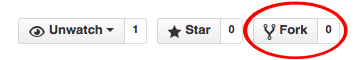
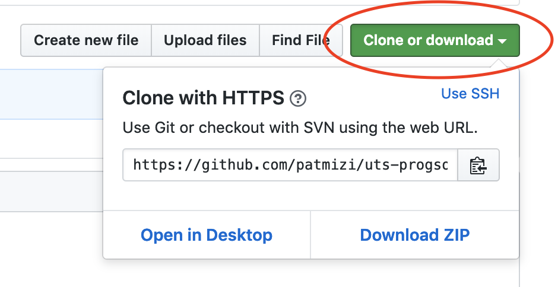
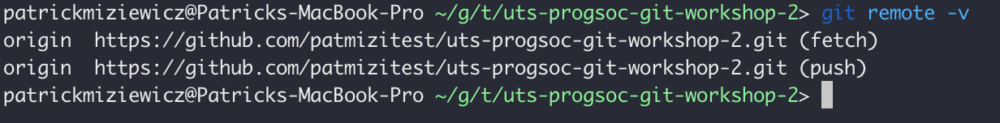
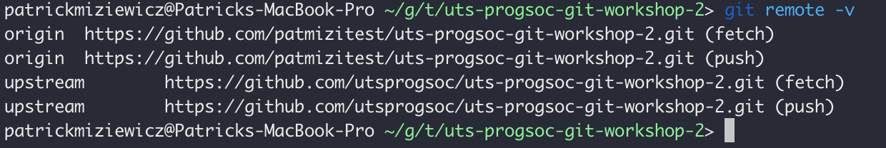
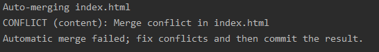

## UTS ProgSoc Git Workshop
This portion of the workshop will revolve around what to do when encountering a
merge conflict. Please make sure that you fork this repository and not create your
own.

### Getting Started

To get started, fork this repository.



The next step is to clone the forked version of this repository. On the main page of the repo, copy the url shown here:



Then use the command in your terminal:

```
git clone https://github.com/<your_github_username>/uts-progsoc-git-workshop-2.git
```

You should now be able to redirect into the directory just created using the command line.

Next, it is good to get in the habit after each command to use `git status`. Let us use it now.

```
git status
```

Now check which branch you are on:

```
git branch
```

You should only see `master` which is the default branch in this repo.

When there are other branches in your repo the green branch is the current one you are on.

### Merge Conflicts

This happens when two developers work on the same file at the same time. Usually each branch is supposed to work on
files independent of other branches but sometimes it can't be helped ¯\\\_(ツ)\_/¯

In this exercise you will learn to resolve a merge conflict by pulling in conflicting changes from this upstream
repository.

#### Preparation

To start off, make sure you have no existing changes in the cloned repo

```
git status
```

Now we are going to add an upstream repository. First list the current configured remote repositories.



Next, add the repository which you forked from to your list of upstream repos:

```
git remote add upstream https://github.com/utsprogsoc/uts-progsoc-git-workshop-2.git
```

And now verify that the new upstream repository has been added to your list of remote repositories:



Next, you will make changes to the index.html file using your favourite text editor. This file is an html document
containing a basic html table with some content.

Add some extra rows to this table and push those changes to the remote repository.

```
git add index.html
git status
git commit -m 'Added some extra rows to the table'
git push
```

#### Creating the merge conflict

After pushing your changes, and under the instruction of the the person running the workshop. You are going
to synchronise changes from the source of the forked repo. To do this you will need to run the following commands:

```
git fetch upstream
git merge upstream/master
```

If done correctly this should create a merge conflict in index.html and you should see the following output:



To resolve the conflict you will need to open up your favourite text editor and open up index.html. You will
notice the addition of some conflict markers denoted by `<<<<<<<`, `=======` and `>>>>>>>`

Edit the file to resolve the conflict and commit your changes

```
git add .
git commit -m 'Resolved merge conflict'
git push
```
